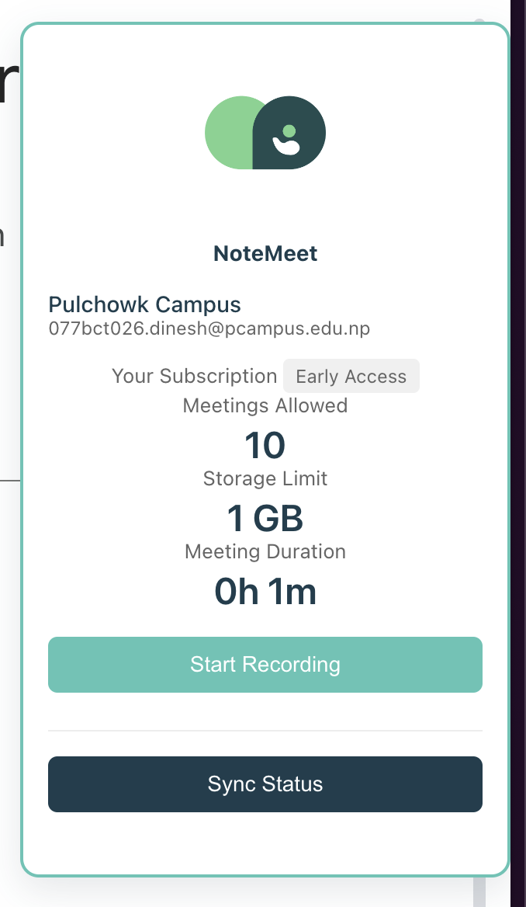

# NoteMeet 

[NoteMeet](https://notemeet.dineshchhantyal.com) is a powerful meeting management tool designed to enhance collaboration, improve productivity, and streamline meeting follow-ups. It automatically generates meeting transcripts, provides actionable insights, and helps users stay organized with reminders and summaries. With advanced NLP features like sentiment analysis, action item extraction, and date/event reminders, NoteMeet makes meetings more efficient and impactful.

---

## Features

### 1. **Transcript Management**
   - **Automatic Transcript Generation**: Convert audio and video from meetings into accurate text transcripts.
   - **Searchable Transcript Archives**: Search past meeting transcripts by keywords, dates, topics, or metadata.
   - **Speaker Identification**: Automatically distinguish between different speakers for clearer understanding.

### 2. **Meeting Management**

### 3. **Action Item and Date Detection**
   - **Automated Action Item Extraction**: Detect action items from the transcript (e.g., tasks, deadlines).
   - **Date and Event Reminders**: Extract dates and deadlines from the transcript and send automatic reminders via email or notifications.
   - **Calendar Integration**: Automatically create calendar events from meeting dates and deadlines.

### 4. **Analytics and Insights**
   - **Meeting Analytics**: Track meeting duration, speaking time, and the frequency of discussed topics.
   - **Sentiment Analysis**: Analyze the tone of the meeting (positive, neutral, negative) to gain insights into participant engagement.
   
### 5. **Clip Generation**
   - **Clip Highlights**: Generate short video/audio clips for key moments like decisions or action items.
   - **Key Moments Notification**: Notify participants when important moments are discussed during the meeting.

### 6. **Search Functionality**
   - **Advanced Search**: Search for specific keywords, phrases, action items, or even by sentiment within meeting transcripts.
   - **Tagging and Indexing**: Easily tag and index transcript sections for faster searching and navigation.

---

## NoteMeet Cloud Architecture

## Sub Repositories

| Repository | Description | Link |
|------------|-------------|------|
| NoteMeet Live | Production deployment | [Visit →](https://notemeet.dineshchhantyal.com) |
| NoteMeet Frontend | Next.js based web application | [GitHub →](https://github.com/dineshchhantyal/NoteMeet-Frontend) |
| NoteMeet Spawner | Selenium WebDriver automation setup | [GitHub →](https://github.com/dineshchhantyal/NoteMeetSpawner) |
| NoteMeet Cloud Infrastructure | AWS infrastructure as code | [GitHub →](https://github.com/dineshchhantyal/NoteMeetCloudInfra) |
| NoteMeet Browser Extension | Chrome/Firefox extension | [GitHub →](https://github.com/dineshchhantyal/NoteMeet-BrowserExtension) |

### NoteMeet Spawner
The NoteMeet Spawner repository automates Selenium WebDriver instance setup for testing:
- Automatically launches WebDriver instances tailored to your environment
- Provides customizable WebDriver configurations
- Enables seamless integration with NoteMeet for end-to-end testing

## Browser Extension
Enhance your meeting experience with our browser extension.

[Get the extension →](https://chrome.google.com/webstore/detail/notemeet)
